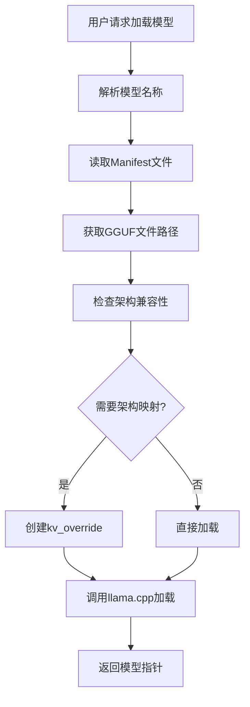
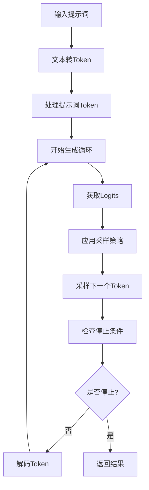

# Ollama架构深度分析

## 概述

本文档基于对duorou项目中ollama相关实现的深度分析，详细阐述了ollama的核心架构、模型管理机制、加载流程和推理机制。duorou项目实现了一个兼容ollama的模型加载和推理系统，通过分析其实现可以深入理解ollama的工作原理。

## 1. 核心架构组件

### 1.1 主要组件概览

```
duorou/src/core/
├── ollama_model_loader.cpp/h     # Ollama模型加载器
├── model_path_manager.cpp/h      # 模型路径管理
├── modelfile_parser.cpp/h        # Modelfile解析器
├── text_generator.cpp/h          # 文本生成引擎
├── model_manager.cpp/h           # 模型管理器
└── resource_manager.cpp/h        # 资源管理器
```

### 1.2 扩展组件

```
duorou/src/extensions/llama_cpp/
├── model_loader_wrapper.cpp/h           # 模型加载包装器
├── ggml_incremental_extension.cpp/h     # GGML增量扩展
├── gguf_modifier.cpp/h                  # GGUF文件修改器
├── compatibility_checker.cpp/h          # 兼容性检查器
└── model_config_manager.cpp/h           # 模型配置管理器
```

## 2. 支持的模型类型和架构

### 2.1 原生支持的架构

基于llama.cpp原生支持的架构：
- **LLaMA系列**: llama, llama2, llama3, llama3.1, llama3.2
- **Qwen系列**: qwen, qwen2, qwen2vl
- **Gemma系列**: gemma, gemma2
- **Mistral系列**: mistral, mixtral
- **其他**: phi, codellama, deepseek等

### 2.2 增量扩展架构

通过GGML增量扩展支持的新架构：

```cpp
// 注册的架构扩展
Qwen25VLExtension::registerExtension();
Gemma3Extension::registerExtension();
Mistral3Extension::registerExtension();
GptossExtension::registerExtension();
```

#### 架构映射关系
- `qwen25vl` → `qwen2vl` (基础架构)
- `gemma3` → `gemma2` (基础架构)
- `mistral3` → `mistral` (基础架构)
- `gptoss` → `llama` (基础架构)

### 2.3 架构特性支持

| 架构 | 视觉支持 | 多模态 | 滑动窗口注意力 | 特殊处理 |
|------|----------|--------|----------------|----------|
| qwen25vl | ✓ | ✓ | ✗ | ✓ |
| qwen2vl | ✓ | ✓ | ✗ | ✓ |
| gemma3 | ✗ | ✗ | ✗ | ✓ |
| mistral3 | ✗ | ✗ | ✓ | ✓ |
| gptoss | ✗ | ✗ | ✗ | ✓ |

## 3. 模型管理机制

### 3.1 模型路径管理

`ModelPathManager`负责管理ollama模型的存储路径和元数据：

```cpp
class ModelPathManager {
public:
    bool readManifest(const ModelPath& model_path, ModelManifest& manifest);
    std::string getModelDirectory(const ModelPath& model_path);
    std::vector<std::string> listAvailableModels();
};
```

#### 模型存储结构
```
~/.ollama/models/
├── manifests/
│   └── registry.ollama.ai/
│       └── library/
│           └── llama3.2/
│               └── latest
└── blobs/
    ├── sha256-abc123...  # 模型权重文件
    ├── sha256-def456...  # 配置文件
    └── sha256-ghi789...  # 其他资源
```

### 3.2 Manifest文件解析

Manifest文件包含模型的元数据信息：
- 模型架构类型
- 权重文件引用
- 配置参数
- 依赖关系

### 3.3 Modelfile解析

`ModelfileParser`解析ollama的Modelfile格式：

```modelfile
FROM llama3.2:latest
PARAMETER temperature 0.8
PARAMETER top_p 0.9
SYSTEM "You are a helpful assistant."
```

## 4. 模型加载流程

### 4.1 加载流程概览



### 4.2 核心加载逻辑

```cpp
llama_model* OllamaModelLoader::loadFromModelPath(
    const ModelPath& model_path,
    const llama_model_params& model_params) {
    
    // 1. 读取manifest文件
    ModelManifest manifest;
    if (!model_path_manager_->readManifest(model_path, manifest)) {
        return nullptr;
    }
    
    // 2. 获取GGUF文件路径
    std::string gguf_path = getGGUFPathFromManifest(manifest);
    
    // 3. 使用ModelLoaderWrapper加载模型
    return ModelLoaderWrapper::loadModelWithArchMapping(gguf_path, model_params);
}
```

### 4.3 架构映射机制

#### 4.3.1 架构检查

```cpp
bool ModelLoaderWrapper::checkArchitectureMapping(
    const std::string& model_path,
    std::string& original_arch,
    std::string& mapped_arch) {
    
    // 读取GGUF文件中的架构信息
    struct gguf_context* gguf_ctx = gguf_init_from_file(model_path.c_str(), params);
    const char* arch_str = gguf_get_val_str(gguf_ctx, arch_index);
    original_arch = std::string(arch_str);
    
    // 检查是否需要映射
    if (GGMLIncrementalExtension::isArchitectureSupported(original_arch)) {
        mapped_arch = GGMLIncrementalExtension::getBaseArchitecture(original_arch);
        return true;
    }
    
    return false;
}
```

#### 4.3.2 KV Override机制

对于需要架构映射的模型，使用llama.cpp的kv_override机制：

```cpp
std::vector<llama_model_kv_override> ModelLoaderWrapper::createArchOverrides(
    const std::string& mapped_arch,
    const std::string& model_path) {
    
    std::vector<llama_model_kv_override> overrides;
    
    // 创建架构覆盖
    llama_model_kv_override arch_override = {};
    strcpy(arch_override.key, "general.architecture");
    arch_override.tag = LLAMA_KV_OVERRIDE_TYPE_STR;
    strncpy(arch_override.val_str, mapped_arch.c_str(), 
            sizeof(arch_override.val_str) - 1);
    
    overrides.push_back(arch_override);
    return overrides;
}
```

### 4.4 内存管理

模型加载过程中的内存管理策略：
- **VRAM估算**: 通过`estimateGPULayers`预测GPU内存使用
- **分层加载**: 支持部分GPU加载（`n_gpu_layers`参数）
- **内存映射**: 支持mmap减少内存占用
- **缓存管理**: KV缓存的动态分配和清理

## 5. 模型推理机制

### 5.1 文本生成器架构

```cpp
class TextGenerator {
public:
    GenerationResult generate(const std::string& prompt, 
                             const GenerationParams& params);
    GenerationResult generateStream(const std::string& prompt, 
                                   StreamCallback callback,
                                   const GenerationParams& params);
private:
    llama_token sampleToken(float* logits, const GenerationParams& params);
    void applyRepeatPenalty(float* logits, const std::vector<llama_token>& last_tokens, float penalty);
    void applyTopK(float* logits, int k);
    void applyTopP(float* logits, float p);
    void applyTemperature(float* logits, float temperature);
};
```

### 5.2 推理流程



### 5.3 采样策略

#### 5.3.1 温度采样

```cpp
void TextGenerator::applyTemperature(float* logits, float temperature) {
    if (temperature <= 0.0f) {
        // 贪婪采样：选择概率最高的token
        int max_idx = std::max_element(logits, logits + vocab_size_) - logits;
        std::fill(logits, logits + vocab_size_, -INFINITY);
        logits[max_idx] = 0.0f;
    } else {
        // 温度缩放
        for (int i = 0; i < vocab_size_; ++i) {
            logits[i] /= temperature;
        }
    }
}
```

#### 5.3.2 Top-K采样

```cpp
void TextGenerator::applyTopK(float* logits, int k) {
    if (k >= vocab_size_) return;
    
    std::vector<std::pair<float, int>> logit_pairs;
    for (int i = 0; i < vocab_size_; ++i) {
        logit_pairs.emplace_back(logits[i], i);
    }
    
    // 部分排序，保留前k个
    std::partial_sort(logit_pairs.begin(), logit_pairs.begin() + k, 
                     logit_pairs.end(),
                     [](const auto& a, const auto& b) { return a.first > b.first; });
    
    // 将非top-k的logits设为负无穷
    for (int i = k; i < vocab_size_; ++i) {
        logits[logit_pairs[i].second] = -INFINITY;
    }
}
```

#### 5.3.3 Top-P (Nucleus)采样

```cpp
void TextGenerator::applyTopP(float* logits, float p) {
    std::vector<std::pair<float, int>> logit_pairs;
    for (int i = 0; i < vocab_size_; ++i) {
        logit_pairs.emplace_back(logits[i], i);
    }
    
    std::sort(logit_pairs.begin(), logit_pairs.end(),
             [](const auto& a, const auto& b) { return a.first > b.first; });
    
    // 计算累积概率
    float cumsum = 0.0f;
    for (size_t i = 0; i < logit_pairs.size(); ++i) {
        cumsum += logit_pairs[i].first;
        if (cumsum > p) {
            // 截断超出p的部分
            for (size_t j = i + 1; j < logit_pairs.size(); ++j) {
                logits[logit_pairs[j].second] = -INFINITY;
            }
            break;
        }
    }
}
```

#### 5.3.4 重复惩罚

```cpp
void TextGenerator::applyRepeatPenalty(float* logits, 
                                     const std::vector<llama_token>& last_tokens, 
                                     float penalty) {
    for (llama_token token : last_tokens) {
        if (token >= 0 && token < vocab_size_) {
            if (logits[token] > 0) {
                logits[token] /= penalty;  // 降低正logits
            } else {
                logits[token] *= penalty;  // 增强负logits
            }
        }
    }
}
```

### 5.4 生成参数

```cpp
struct GenerationParams {
    int max_tokens = 100;           // 最大生成token数
    float temperature = 0.8f;       // 温度参数
    float top_p = 0.9f;            // Top-p采样参数
    int top_k = 40;                // Top-k采样参数
    float repeat_penalty = 1.1f;    // 重复惩罚
    int repeat_last_n = 64;        // 重复惩罚考虑的token数
    std::vector<std::string> stop_sequences;  // 停止序列
    bool stream = false;           // 是否流式输出
};
```

### 5.5 流式生成

支持实时流式输出，通过回调函数逐token返回结果：

```cpp
using StreamCallback = std::function<void(llama_token token, const std::string& text, bool finished)>;

GenerationResult generateStream(const std::string& prompt, 
                               StreamCallback callback,
                               const GenerationParams& params);
```

## 6. 兼容性和扩展性

### 6.1 兼容性检查

`CompatibilityChecker`提供全面的兼容性检查：

```cpp
struct CompatibilityResult {
    std::string originalArchitecture;
    std::string mappedArchitecture;
    CompatibilityLevel level;
    bool needsOllamaEngine;
    bool hasVisionSupport;
    bool hasAdvancedAttention;
    std::vector<std::string> warnings;
    std::vector<std::string> errors;
    std::vector<std::string> requiredModifications;
    std::unordered_map<std::string, std::string> recommendations;
};
```

### 6.2 扩展机制

#### 6.2.1 GGML增量扩展

通过增量扩展支持新架构，避免重复实现：

```cpp
class GGMLIncrementalExtension {
public:
    static void registerArchitectureExtension(
        const std::string& arch_name,
        const std::string& base_arch,
        std::function<bool(void*)> modifications
    );
};
```

#### 6.2.2 模型特定扩展

每个新架构都有对应的扩展类：

```cpp
class Qwen25VLExtension {
public:
    static bool applyModifications(void* model_params);
    static void registerExtension();
};
```

### 6.3 GGUF文件修改

`GGUFModifier`提供GGUF文件的动态修改能力：
- 架构字段修改
- 缺失键值对添加
- 视觉模型元数据处理
- 注意力机制元数据处理

## 7. 性能优化

### 7.1 内存优化

- **内存映射**: 使用mmap减少内存占用
- **分层加载**: 根据GPU内存动态调整加载层数
- **KV缓存优化**: 动态分配和清理KV缓存

### 7.2 计算优化

- **GPU加速**: 支持CUDA、Metal等GPU后端
- **量化支持**: 支持多种量化格式（Q4_0, Q4_1, Q8_0等）
- **批处理**: 支持批量推理

### 7.3 I/O优化

- **异步加载**: 模型加载过程异步化
- **缓存机制**: 模型文件和元数据缓存
- **流式处理**: 支持流式输入输出

## 8. 总结

### 8.1 架构优势

1. **模块化设计**: 清晰的组件分离，易于维护和扩展
2. **兼容性强**: 支持ollama原生格式和扩展架构
3. **性能优化**: 多层次的性能优化策略
4. **扩展性好**: 通过增量扩展支持新架构

### 8.2 技术特点

1. **架构映射**: 通过kv_override机制实现架构兼容
2. **增量扩展**: 基于现有架构扩展新功能
3. **多模态支持**: 支持视觉-语言模型
4. **流式生成**: 实时响应用户交互

### 8.3 应用场景

1. **本地AI应用**: 离线运行大语言模型
2. **多模态应用**: 图像理解和生成
3. **定制化部署**: 企业级AI应用部署
4. **研究开发**: AI模型研究和实验

这个架构分析展示了ollama作为本地AI模型运行平台的强大能力和灵活性，为开发者提供了完整的模型管理、加载和推理解决方案。