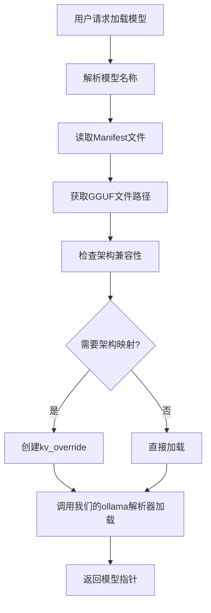
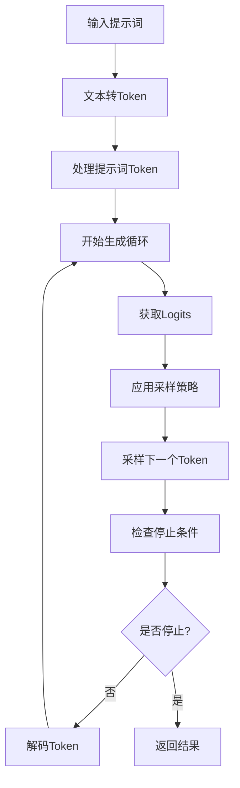

# Ollama架构深度分析


#### ollama模型存储结构
```
~/.ollama/models/
├── manifests/
│   └── registry.ollama.ai/
│       └── library/
│           └── llama3.2/
│               └── latest
└── blobs/
    ├── sha256-abc123...  # 模型权重文件
    ├── sha256-def456...  # 配置文件
    └── sha256-ghi789...  # 其他资源
```

### 3.2 Manifest文件解析

Manifest文件包含模型的元数据信息：
- 模型架构类型
- 权重文件引用
- 配置参数
- 依赖关系

### 3.3 Modelfile解析

`ModelfileParser`解析ollama的Modelfile格式：

```modelfile
FROM llama3.2:latest
PARAMETER temperature 0.8
PARAMETER top_p 0.9
SYSTEM "You are a helpful assistant."
```

## 4. 模型加载流程

### 4.1 加载流程概览



### 4.2 核心加载逻辑

```cpp
llama_model* OllamaModelLoader::loadFromModelPath(
    const ModelPath& model_path,
    const llama_model_params& model_params) {
    
    // 1. 读取manifest文件
    ModelManifest manifest;
    if (!model_path_manager_->readManifest(model_path, manifest)) {
        return nullptr;
    }
    
    // 2. 获取GGUF文件路径
    std::string gguf_path = getGGUFPathFromManifest(manifest);
    
    // 3. 使用ModelLoaderWrapper加载模型
    return ModelLoaderWrapper::loadModelWithArchMapping(gguf_path, model_params);
}
```


## 5. 模型推理机制


### 5.1 推理流程



### 5.3 采样策略

#### 5.3.1 温度采样

```cpp
void TextGenerator::applyTemperature(float* logits, float temperature) {
    if (temperature <= 0.0f) {
        // 贪婪采样：选择概率最高的token
        int max_idx = std::max_element(logits, logits + vocab_size_) - logits;
        std::fill(logits, logits + vocab_size_, -INFINITY);
        logits[max_idx] = 0.0f;
    } else {
        // 温度缩放
        for (int i = 0; i < vocab_size_; ++i) {
            logits[i] /= temperature;
        }
    }
}
```

#### 5.3.2 Top-K采样

```cpp
void TextGenerator::applyTopK(float* logits, int k) {
    if (k >= vocab_size_) return;
    
    std::vector<std::pair<float, int>> logit_pairs;
    for (int i = 0; i < vocab_size_; ++i) {
        logit_pairs.emplace_back(logits[i], i);
    }
    
    // 部分排序，保留前k个
    std::partial_sort(logit_pairs.begin(), logit_pairs.begin() + k, 
                     logit_pairs.end(),
                     [](const auto& a, const auto& b) { return a.first > b.first; });
    
    // 将非top-k的logits设为负无穷
    for (int i = k; i < vocab_size_; ++i) {
        logits[logit_pairs[i].second] = -INFINITY;
    }
}
```

#### 5.3.3 Top-P (Nucleus)采样

```cpp
void TextGenerator::applyTopP(float* logits, float p) {
    std::vector<std::pair<float, int>> logit_pairs;
    for (int i = 0; i < vocab_size_; ++i) {
        logit_pairs.emplace_back(logits[i], i);
    }
    
    std::sort(logit_pairs.begin(), logit_pairs.end(),
             [](const auto& a, const auto& b) { return a.first > b.first; });
    
    // 计算累积概率
    float cumsum = 0.0f;
    for (size_t i = 0; i < logit_pairs.size(); ++i) {
        cumsum += logit_pairs[i].first;
        if (cumsum > p) {
            // 截断超出p的部分
            for (size_t j = i + 1; j < logit_pairs.size(); ++j) {
                logits[logit_pairs[j].second] = -INFINITY;
            }
            break;
        }
    }
}
```

#### 5.3.4 重复惩罚

```cpp
void TextGenerator::applyRepeatPenalty(float* logits, 
                                     const std::vector<llama_token>& last_tokens, 
                                     float penalty) {
    for (llama_token token : last_tokens) {
        if (token >= 0 && token < vocab_size_) {
            if (logits[token] > 0) {
                logits[token] /= penalty;  // 降低正logits
            } else {
                logits[token] *= penalty;  // 增强负logits
            }
        }
    }
}
```

### 5.4 生成参数

```cpp
struct GenerationParams {
    int max_tokens = 100;           // 最大生成token数
    float temperature = 0.8f;       // 温度参数
    float top_p = 0.9f;            // Top-p采样参数
    int top_k = 40;                // Top-k采样参数
    float repeat_penalty = 1.1f;    // 重复惩罚
    int repeat_last_n = 64;        // 重复惩罚考虑的token数
    std::vector<std::string> stop_sequences;  // 停止序列
    bool stream = false;           // 是否流式输出
};
```

### 5.5 流式生成

支持实时流式输出，通过回调函数逐token返回结果：

```cpp
using StreamCallback = std::function<void(llama_token token, const std::string& text, bool finished)>;

GenerationResult generateStream(const std::string& prompt, 
                               StreamCallback callback,
                               const GenerationParams& params);
```

## 6. 兼容性和扩展性

### 6.1 兼容性检查

`CompatibilityChecker`提供全面的兼容性检查：

```cpp
struct CompatibilityResult {
    std::string originalArchitecture;
    std::string mappedArchitecture;
    CompatibilityLevel level;
    bool needsOllamaEngine;
    bool hasVisionSupport;
    bool hasAdvancedAttention;
    std::vector<std::string> warnings;
    std::vector<std::string> errors;
    std::vector<std::string> requiredModifications;
    std::unordered_map<std::string, std::string> recommendations;
};
```

