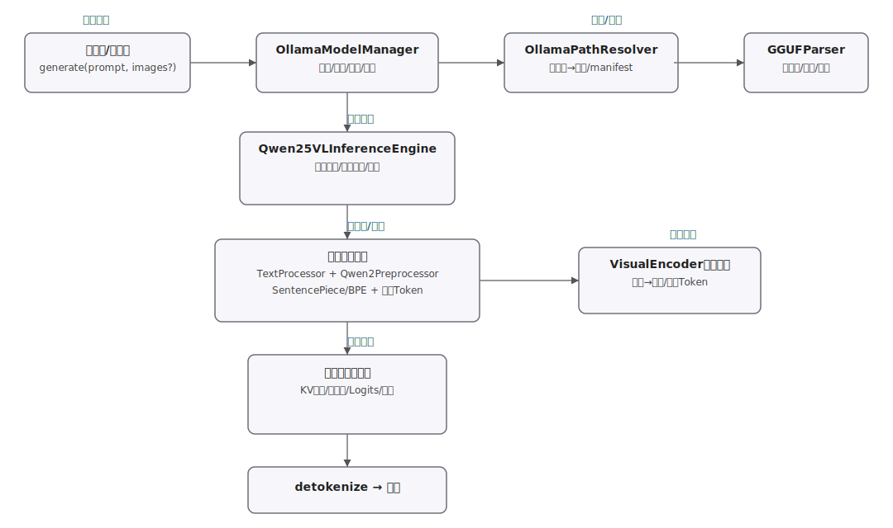

# duorou/ollama 扩展详细分析（以 Qwen2.5-VL 为主）

本文档对 `src/extensions/ollama` 目录进行系统性解析，重点说明 Qwen2.5-VL 模型在该扩展中的加载、预处理、推理与管理流程，帮助你快速理解代码结构与扩展点。

## 1. 目录结构与关键文件
- 模型推理引擎：
  - qwen25vl_inference_engine.h/.cpp：Qwen2.5-VL 推理引擎核心定义与实现，包含模型配置、视觉编码器、Transformer 层、KV 缓存、tokenize/detokenize、文本/图像生成等能力。
- 预处理与分词：
  - text_processor.h/.cpp：通用文本处理器与词表（Vocabulary）管理，提供编码/解码、特殊 token 处理等。
  - bpe_processor.h/.cpp、sentencepiece_processor.h/.cpp：两类分词实现（BPE、SentencePiece），供不同架构或词表风格选择。
  - qwen2_preprocessor.h/.cpp：Qwen2 系列专用的对话/提示词（prompt）格式化与特殊 token 处理逻辑。
  - qwen25vl_special_tokens.h：Qwen2.5-VL 专用特殊 token ID 与映射（如 <|im_start|>、<|vision_start|> …）。
- 模型文件解析：
  - gguf_parser.h/.cpp：解析 GGUF 模型文件，读取元数据、张量信息、架构类型（包含 qwen25vl/qwen2.5vl 等别名）、并支持 mmap 以提高加载效率。
- 模型管理与路径：
  - ollama_model_manager.h/.cpp：统一的模型生命周期管理与多模型注册/切换；提供以文本/图像为输入的生成接口；管理具体推理引擎实例。
  - ollama_path_resolver.h/.cpp：Ollama 风格模型路径解析与 manifest 读取（根据模型名定位 .gguf、分词文件、资源等）。
- 测试与构建：
  - integration_test_qwen25vl.cpp：面向 Qwen2.5-VL 的集成测试样例（加载、简单推理路径验证）。
  - CMakeLists.txt：编译入口，罗列上述源与头文件。

## 2. Qwen2.5-VL 模型结构与推理引擎
核心类：Qwen25VLInferenceEngine（头文件内定义了模型相关结构体与成员）。关键点：
- 模型配置（ModelConfig）：包含 hidden_size、层数、注意力头数、上下文长度、视觉编码器维度等；通常内置了如 7B 规模的默认参数配置。
- 视觉编码器（VisualEncoder）：负责将图像（或视觉 token）编码到与文本同一语义空间，用于多模态对齐。
- Transformer 层与注意力：定义注意力头、前馈、归一化等组件数据结构；
- KV 缓存：为增量解码与长上下文提供高效注意力缓存；
- 分词与反分词：对接 TextProcessor 及下游 Processor（SentencePiece/BPE），并处理特殊 token；
- 接口能力（常见）：
  - load/unload：加载/释放模型权重、词表、视觉资源；
  - tokenize/detokenize：将字符串与 token id 相互转换；
  - generate（文本/多模态）：支持仅文本生成，以及附带图像输入的多模态生成；
  - setSeed/setParams：推理超参设置（温度、top-k/p、max_tokens 等）。

## 3. 预处理与分词
- TextProcessor/Vocabulary：
  - 初始化词表、类型（NORMAL/USER_DEFINED/UNUSED 等）与分值（score）；
  - 提供 encode/decode、is(special)、addSpecials、getSpecialVocabulary 等；
  - 负责将模型专用特殊 token 纳入词表空间。
- SentencePieceProcessor：
  - 面向 SentencePiece 风格词表；
  - encode：
    1) 先切分并内嵌特殊 token 片段；
    2) 对普通片段做空格替换（▁）、直查词表、或基于合并队列的子词合并；
    3) 可选在末尾添加 BOS/EOS 等特殊 token。
  - decode：
    - 跳过 BOS/EOS/视觉相关 token；
    - 处理 GPT 风格“Ġ”与 SentencePiece 风格“▁”的空格还原；
    - 解析类似 “<0xEA>” 形式的字节 token；
    - 友好处理中文与 Unicode 文本拼接。
- BPEProcessor：
  - 面向 BPE 风格词表的另一种实现；
- Qwen2Preprocessor：
  - 将多轮对话构造成 Qwen2 系列所需的模板，插入 <|im_start|>/<|im_end|>、<|endoftext|> 等；
  - 支持图像占位与视觉段落的 token 包装（如 <|vision_start|> … <|vision_end|>）。
- Qwen2.5-VL 特殊 token：
  - qwen25vl_special_tokens.h 中集中定义并提供映射；
  - 包含会话、视觉、工具调用、推理“思考”片段等 token；
  - 同时示例了一批中文常见词的 token 映射，便于语言侧测试与解码处理。

## 4. GGUF 模型解析
- 支持的架构名单包含 Qwen2.5-VL 的多种别名（qwen25vl、qwen2.5vl、qwen-2.5vl、qwen2vl 等），并兼容 qwen2/llama/mistral；
- 主要流程：
  1) 读取并校验文件头（magic/version）；
  2) 解析 metadata 键值表（字符串、数值、数组等）；
  3) 解析各张量信息（名称、形状、类型、偏移），并计算 tensor data offset；
  4) 可选使用 mmap 加速大文件读取；
  5) 解析并归档“架构名称”，据此选择对应推理引擎与预处理器。
- 安全性与健壮性：
  - 对数组长度、字符串长度、内存分配等做了上限与校验；
  - 解析失败时返回空或安全退出，避免异常蔓延。

## 5. 模型管理与路径解析
- OllamaPathResolver：
  - 解析“模型名 → 物理路径”，如 models 目录下的 .gguf、分词器/资源文件；
  - 支持 manifest 读取并合并配置（quant、variants、依赖资源等）。
- OllamaModelManager：
  - 负责多模型注册与生命周期管理（load/unload）；
  - 内部维护“模型名 → 推理引擎实例”的映射；
  - 统一提供文本生成与含图像输入的生成接口，并在内部路由到 Qwen25VLInferenceEngine；
  - 提供全局单例 GlobalModelManager 便于在应用内跨模块调用。

## 6. 生成调用路径（文本与多模态）
- 仅文本：
  1) 外部调用 ModelManager 的 generate 接口；
  2) 通过 TextProcessor/Qwen2Preprocessor 构造 prompt 并 tokenize；
  3) 进入 Qwen25VLInferenceEngine：准备 KV 缓存 → 逐步解码 → detokenize 汇总；
  4) 返回字符串输出。
- 文本 + 图像：
  1) 预处理阶段在对话模板中插入视觉片段 token（<|vision_start|>…<|vision_end|>），并将图像送入 VisualEncoder；
  2) 将编码后的视觉向量/序列拼接到文本 token 序列，作为上下文输入；
  3) 解码阶段与仅文本路径一致，但注意注意力掩码会覆盖视觉段；
  4) detokenize 生成文本结果。

## 7. 测试与构建
- integration_test_qwen25vl.cpp 给出最小路径：装载一份 Qwen2.5-VL 的 GGUF、喂入简短 prompt、触发一次生成，验证整体链路；
- CMakeLists.txt 列出所有源文件并组织目标；确保在开启/关闭 mmap、不同分词器实现下均能编译通过。

## 8. 与其他架构的差异与兼容
- 架构识别在 GGUF 层统一进行；
- TextProcessor 层抽象了词表与分词器，便于不同架构切换；
- 视觉相关逻辑主要封装在 Qwen2.5-VL 引擎与 Qwen2Preprocessor，其他纯文本模型（如 llama/mistral）不会依赖视觉编码器分支。

## 9. 可扩展点与注意事项
- 扩展新模型：
  - 在 GGUF 架构识别中注册别名；
  - 实现对应 InferenceEngine 与 Preprocessor；
  - 在 ModelManager 中注册并路由；
  - 在 PathResolver 中补充路径/资源发现逻辑。
- 视觉输入：
  - 确保 VisualEncoder 的输入尺寸、归一化与位置编码与训练配置一致；
  - 注意特殊 token 序列与视觉向量序列的拼接顺序与 mask；
- 分词一致性：
  - encode/decode 规则需与发布词表完全一致（空格前缀、字节 token、特殊 token 列表）；
  - 若使用自定义特殊 token，需同步更新 Vocabulary 与 Preprocessor；
- 性能：
  - 开启 mmap 读取大 GGUF；
  - 合理设置 KV 缓存与 batch/并行策略；
  - 采样策略（温度、top-k/p、重复惩罚等）应在引擎内统一实现。

## 10. 关键类/函数一览（速查）
- Qwen2.5-VL 引擎：
  - Qwen25VLInferenceEngine：load/unload/tokenize/detokenize/generate(+image)
  - ModelConfig/VisualEncoder/KV 缓存/Attention 等结构体
- 预处理与分词：
  - TextProcessor/Vocabulary：encode/decode/is/addSpecials
  - SentencePieceProcessor：encode/processSpecialTokens/tokenizeFragment/decode
  - BPEProcessor：BPE 风格编码实现
  - Qwen2Preprocessor：多轮对话模板与视觉段落包装
  - Qwen25VLSpecialTokens：Qwen2.5-VL 特殊 token 常量与映射
- 模型解析与管理：
  - GGUFParser：parseFile/parseWithMmap/getMetadata/getTensorInfo/getTensorData
  - OllamaPathResolver：模型名→路径解析、manifest 读取
  - OllamaModelManager：注册/加载/卸载/文本与多模态生成、全局单例

## 11. 实现流程细化（端到端）
本节以“仅文本生成”和“文本+图像生成”两条典型路径，结合具体类与函数，细化实现流程与关键数据结构。

- 11.1 初始化与加载
  - 模型路径解析：OllamaPathResolver 依据模型名解析 GGUF 路径与关联资源（tokenizer、manifest 等）。
  - 模型文件解析：GGUFParser 读取 header → metadata → tensor info，识别架构（qwen25vl/qwen2.5vl 等），并准备张量偏移/映射。
  - 引擎构建：OllamaModelManager 根据架构创建 Qwen25VLInferenceEngine，设置 ModelConfig，加载词表与视觉模块所需权重。

- 11.2 预处理与分词（TextProcessor + Qwen2Preprocessor）
  - 多轮对话模板化：插入 <|im_start|>/<|im_end|> 等会话 token；如含图像，按需插入 <|vision_start|>/<|vision_end|> 包围的视觉占位。
  - 特殊 token 处理：Qwen25VLSpecialTokens 提供特殊 token → id 映射，Vocabulary 将其纳入编码空间。
  - SentencePiece/BPE 编码：
    - SentencePieceProcessor::encode：先切分特殊 token 片段，再对普通文本做空格替换“▁”、词表直查或子词合并；最后可加 BOS/EOS。
    - BPEProcessor：按 BPE 规则进行子词合并，保证与发布词表的一致性。

- 11.3 上下文构建（含视觉输入）
  - 仅文本：prompt token 序列作为上下文直接送入引擎；
  - 文本+图像：
    1) VisualEncoder 接收图像，产出特征或视觉 token；
    2) 将视觉 token 按约定位置拼接到文本 token 序列（通常位于 <|vision_start|> 与 <|vision_end|> 之间）；
    3) 构造注意力 mask，确保文本与视觉部分的交互符合训练范式。

- 11.4 解码与采样循环（Qwen25VLInferenceEngine）
  - KV 缓存：对每层注意力的 K/V 张量进行缓存，实现增量解码与长上下文加速；
  - 前向计算：逐 token 推理，计算 logits；
  - 采样策略：温度缩放、top-k/p、重复惩罚等策略在 logits 上生效，采样得到下一个 token；
  - 早停条件：达到 max_tokens、遇到 <|endoftext|> 或其他停止词；
  - detokenize：通过 TextProcessor/Vocabulary 将 token id 序列还原为字符串（过滤无效/特殊 token）。

- 11.5 资源管理与生命周期
  - ModelManager 统一管理加载/卸载，避免重复加载与资源泄漏；
  - GGUFParser 支持 mmap，降低大模型加载与读取的内存/IO 压力；
  - 可选的全局单例（GlobalModelManager）用于跨模块复用。

配套示意图见：

## 12. 关键注意点（实现级）
- 分词一致性：
  - 确保空格前缀（Ġ/▁）、字节 token（<0x..>）、特殊 token 列表与词表完全一致；
  - 若扩展自定义特殊 token，需同步更新 Vocabulary 与 Qwen2Preprocessor。
- 视觉拼接与 Mask：
  - 保持视觉 token 次序与模型训练一致（位置编码/插入位置）；
  - 正确构造注意力 mask，避免视觉段对不应关注的 token 产生影响。
- 采样策略：
  - 温度/Top-k/Top-p/重复惩罚的应用顺序与数值边界检查；
  - 流式生成时注意缓存刷新与中途停止处理。
- 性能与稳定性：
  - mmap 失败时的回退路径；
  - 超大 metadata/词表的安全上限与异常处理；
  - 长上下文下 KV 缓存增长的内存策略。

## 13. 后续可视化与测试建议
- 可在 integration_test_qwen25vl.cpp 基础上增加：
  - 含视觉输入的端到端用例；
  - 采样参数矩阵（温度、top-k/p）回归测试；
  - detokenize 一致性断言（空格/字节/特殊 token）。
- 进一步补充图示：
  - 注意力掩码构造示意；
  - KV 缓存布局（layer × head × seq）的结构图；
  - 文本与视觉 token 时间步对齐的时序图。